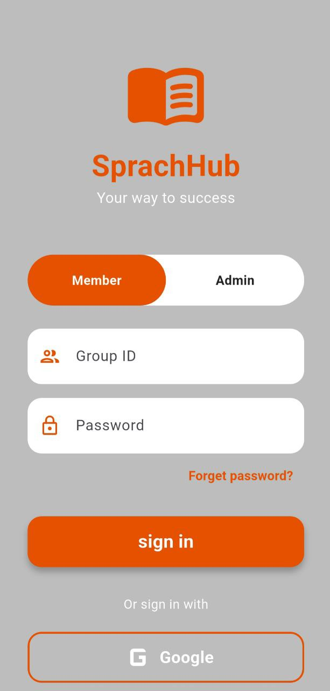
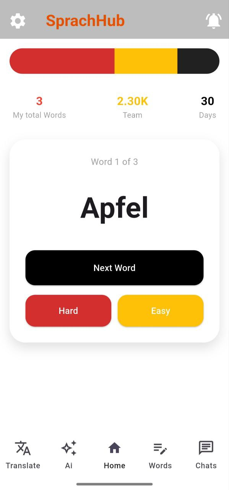
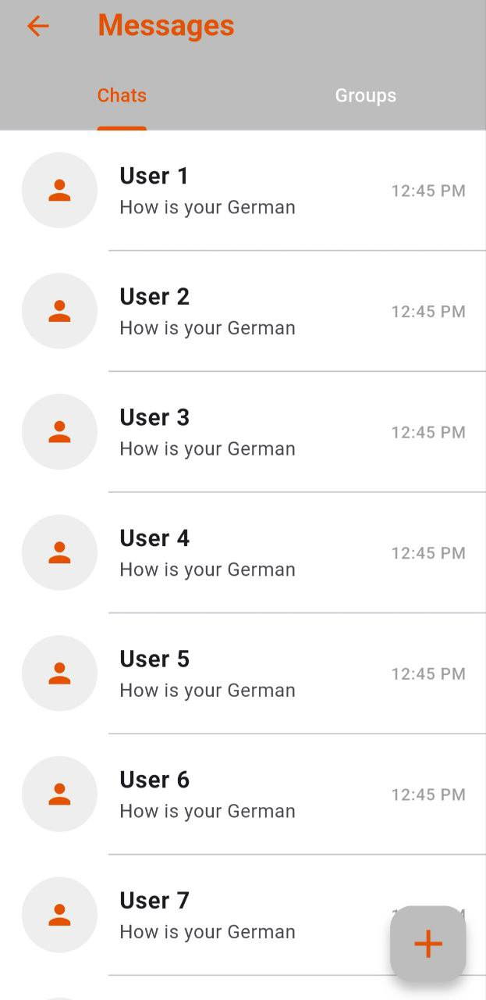
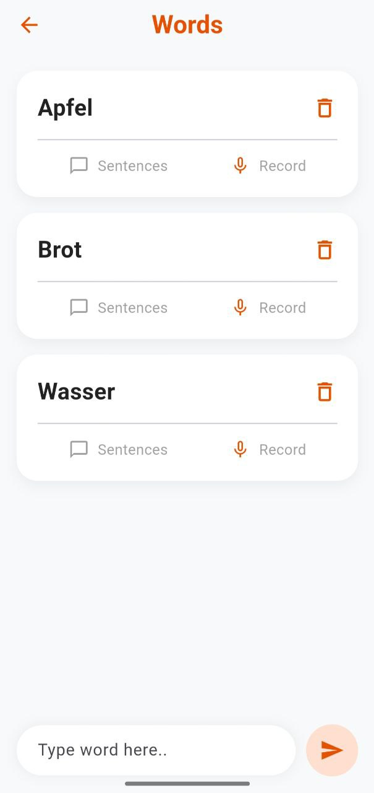
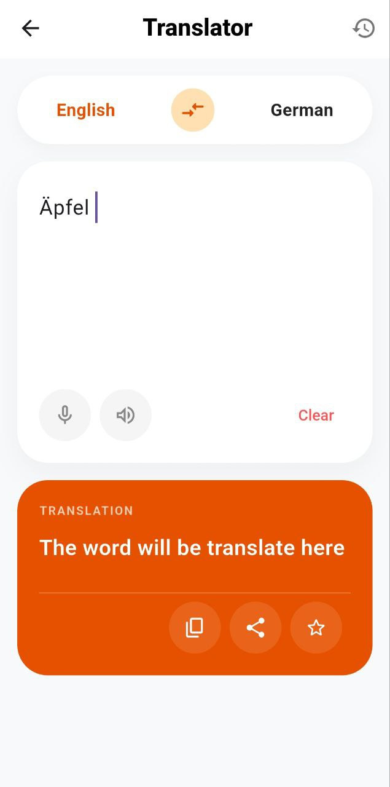
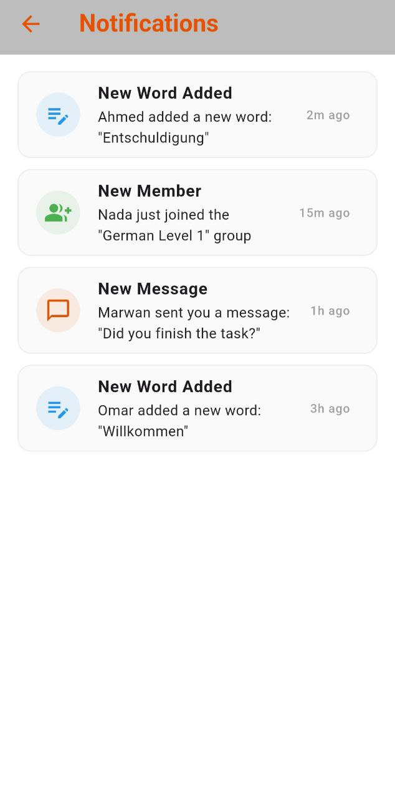
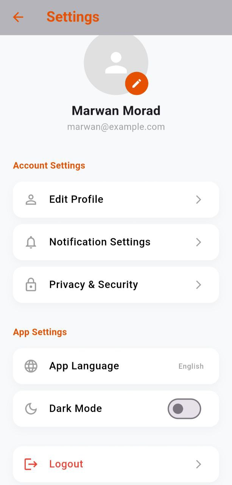

# SprachHub – Smart Language Learning App

SprachHub is a smart language learning mobile application designed to help users improve their vocabulary, practice conversations, and receive AI-powered assistance — all in one place.

---

## About The Project

Learning a new language usually requires multiple tools: chat apps for conversation practice, notebooks for vocabulary, translation tools, and AI assistants. Switching between different platforms makes the process harder and less organized.

SprachHub combines all these features into a single, structured, and interactive mobile application. The goal of this project is to make language learning more practical, organized, and engaging through real usage rather than passive memorization.

This project is being built as part of my journey to become a professional mobile developer and to demonstrate my ability to design and develop a complete application architecture.

---

## Core Features

- Real-time chat system for practicing conversations  
- AI assistant to help users practice language and ask questions  
- Vocabulary saving system with notes and context  
- Voice recording feature for pronunciation practice  
- Built-in translation support  
- Organized personal vocabulary database  

---

## Application Architecture

The app is designed with a scalable architecture separating frontend and backend responsibilities.

### Frontend
- Flutter (Cross-platform mobile development)
- Dart

### Backend (In Progress)
The backend is currently under development using Node.js and Express. It will provide RESTful APIs for:

- User data management  
- Vocabulary storage and retrieval  
- Chat message synchronization  
- AI request handling  
- Secure communication between app and server  

This backend structure is planned to make the application production-ready and scalable.

### Database & Services
- Firebase Authentication  
- Cloud database for storing vocabulary and user data  
- AI API integration for language assistance  

---

## How the App Works

1. Users can start conversations inside the app  
2. New words from chats can be saved to a personal vocabulary list  
3. Each word can include notes or voice recordings  
4. The AI assistant helps explain words and support learning  
5. All saved vocabulary is organized for easy review  

---

## Project Status

The mobile application interface and core features are under active development.  
Backend development using Node.js and Express is currently in progress as part of the planned system architecture.

This project is continuously evolving and being improved step by step.

---

## Future Improvements

- Complete backend API development and deployment  
- Real-time chat using WebSockets  
- Spaced repetition system for vocabulary review  
- Pronunciation evaluation using speech analysis  
- Dark mode  
- Multi-language interface support  

---

## Screenshots

| | |
| :---: | :---: |
|    Login Screen |    Home Screen |
|    Messages |    Words List |
|    Translator |    AI Assistant |
|    Notifications |    Profile |

</div
---

## Developer

Developed by [Marwan Morad]

Aspiring Mobile Developer focused on building real-world, scalable applications.

GitHub: [https://github.com/marwanmorad]  
LinkedIn: [https://www.linkedin.com/in/marwan-morad-dev]
